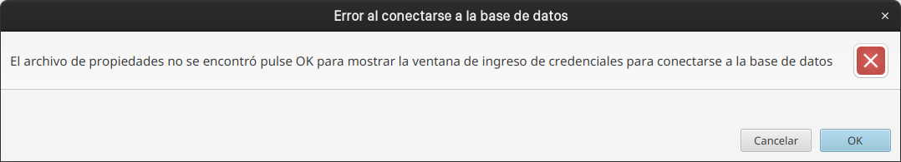
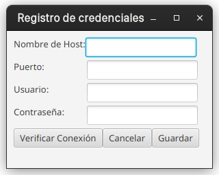
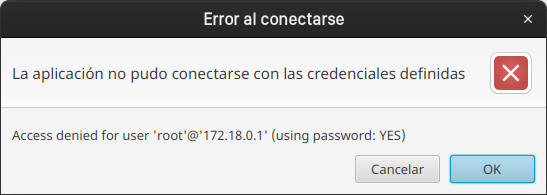
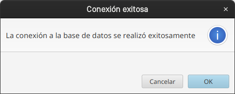
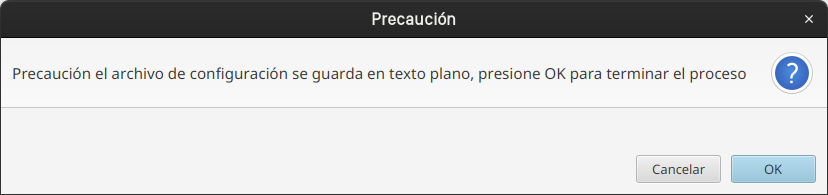
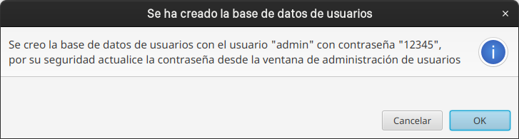
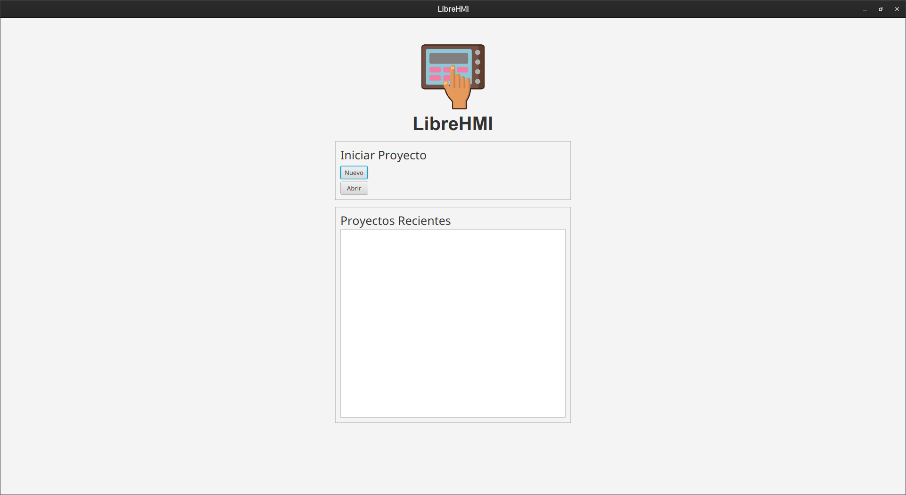
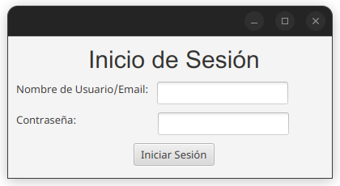
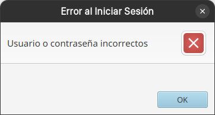

Manual de Usuario De LibreHMI

---

_Autor:_ Luis Andrés Andrade Cabrera  
_Creado:_ 17/06/2022  
_Version:_ 1.0.0

---

## Tabla de contenidos

1. Introducción
2. Primera ejecución
3. Menú superior
4. Menú lateral
5. Elementos de diseño
6. Páginas

---

## 1. Introducción

La aplicación LibreHMI es una alternativa a otras aplicaciones HMI como [AVEVA Edge](https://www.aveva.com/en/products/edge/), sus versiones anteriores como [Wonderware Intouch HMI](https://www.wonderware.fi/hmi-scada/intouch-machine-edition/), etc. Esta aplicación permite agregar distintas representaciones gráficas a un lienzo, así como asociar dichas representaciones gráficas a el valor de un tag de una base de datos específica con la que funcionará la aplicación.

Este manual de usuario se basa en la [plantilla de Markdown](https://webdesign.tutsplus.com/articles/quick-and-easy-documentation-using-markdown--webdesign-8163) desarrollada por [Suhail Dawood](https://tutsplus.com/authors/suhail-dawood).

Esta aplicación requiere de los siguientes elementos para funcionar:

- **Maquina virtual de Java 11:** Obligatorio para el funcionamiento de la aplicación.
- **MySQL 8 o superior:** Obligatorio como fuente de los datos como tags y datos de usuario que la aplicación mostrará.
- **Controlador Ethernet/IP:** Opcional, ya que es una aplicación que permite la conexión hacia PLCs del área industrial y permite observar sus valores en tiempo real, sin embargo la aplicación LibreHMI solamente requiere del esquema de base de datos y puede generarla vacía.

---

## 2. Primera ejecución de LibreHMI

Al ejecutar la aplicación, esta realizará una serie de comprobaciones requeridas para su funcionamiento, en la primera ejecución es muy posible que se muestren los siguientes mensajes al usuario, el primero como se muestra en la Figura 1, le informa al usuario que la aplicación no pudo conectarse a  la base de datos a falta del archivo de propiedades, solicitando al usuario dar clic en "OK" para definirlas.

###### Figura 1. Ventana de diálogo de error de conexión a la base de datos

### 2.1 Función de definición de credenciales de conexión a la base de datos

A continuación la aplicación mostrará como en la Figura 2, una ventana de ingreso de credenciales donde se solicitarán los siguientes campos:

- Nombre de host: La dirección IP donde se encuentra alojado el servidor MySQL
- Puerto: El puerto de conexión habilitado por MySQL para la conexión.
- Usuario: Usuario de la base de datos con privilegios de creación, edición y lectura de esquemas de bases de datos.
- Contraseña: Contraseña del usuario de la base de datos.

###### Figura 2. Ventana de registro de credenciales de conexión a la base de datos

Luego de definir las credenciales para la conexión, se recomienda al usuario utilizar la opción de *Verificar Conexión* desde el botón  con el mismo nombre como se vió en la Figura 2, si estas son erróneas se mostrará un mensaje como el de la Figura 3.

###### Figura 3. Ventana de diálogo informando al usuario que no se pudo conectar.

En cambio si estas son correctas se mostrará un mensaje como el ilustrado en la Figura 4

###### Figura 4. Ventana de diálogo informando al usuario de una conexión exitosa.

Al momento de dar clic en el botón *OK* de la ventana de la Figura 2, se mostrará un mensaje de confirmación al usuario como el que se mostrará en la Figura 5, donde se informa que el archivo de propiedades se guardará en un archivo de texto plano, para terminar el proceso de guardado del archivo  se debe dar clic en el botón *OK* de la ventana de diálogo.

###### Figura 5. Ventana de diálogo informando al usuario de que las credenciales se guardarán en un archivo de texto plano

### 2.2 Función de generación de base de datos

La aplicación luego de conectarse a la base de datos MySQL verificará la existencia de dos esquemas requeridos para su funcionamiento, a continuación se listan los nombres de los esquemas:

- bd_driver_eip: Es el esquema de base de datos que la aplicación utilizará como fuente para el valor de los Tags.
- HMIUsers: Es el esquema de base de datos donde se almacenarán los datos de usuario para poder iniciar sesión en la aplicación.

Si no existen los esquemas requeridos, la aplicación se encargará de generarlas, en el caso del esquema *bd_driver_eip* no contendrá ninguna fila, sin embargo, en el esquema *HMIUsers* se creará con un usuario por defecto "admin" que tendrá como contraseña por defecto "12345", cuando la aplicación genere mostrará un mensaje con dicha información en una ventana como la de la Figura 6

###### Figura 6. Ventana de diálogo informando al usuario que se ha generado la base de datos de usuarios con las credenciales predefinidas.

Finalmente la aplicación mostrará como en la Figura 7, la ventana de bienvenida al usuario donde se mostrarán dos botones para iniciar o cargar un proyecto y una sección donde se mostrarán los archivos de proyecto recientemente utilizados, que al ser la primer ejecución será una lista vacía.

###### Figura 7. Pantalla de Bienvenida de la aplicación

Ahora el usuario puede iniciar un nuevo proyecto de diseño HMI al dar clic en el botón *Nuevo* mostrado en la Figura 7,  lo que provocará que la aplicación solicite el ingreso de las credenciales de usuario con la ventana que se ilustra en la Figura 8.

#### 2.2.1 Opción de Inicio de sesión

###### Figura 8. Pantalla de inicio de sesión de la aplicación

Si el usuario ingresa credenciales erróneas la aplicación mostrará un mensaje informándole de dicho error, como se puede observar en la Figura 9.

###### Figura 9. Ventana de diálogo mostrando el error al usuario

Si las credenciales son correctas se mostrará la pantalla de la Figura 10 que es la pantalla de trabajo donde se podrán agregar las distintas representaciones gráficas que será explicado más adelante.

###### Figura 10. Pantalla de trabajo donde se podrán agregar las representaciones gráficas

---

## 3. Menú superior

Cuando se presenta la pantalla de trabajo de la Figura 10, en la parte superior existirá un menú con diversas opciones que se listarán a continuación:

### 3.1 Archivo

Se mostrarán opciones para iniciar o cargar un proyecto, además de poder acceder rápidamente a los proyectos recientes, también existen las opciones para guardar el proyecto en su estado actual, generar una copia nueva o exportar el proyecto con contraseña y la opción de salir. Este menú se puede observar en la Figura 11.

###### Figura 11. Menú de opciones de Archivo

#### 3.1.1 Opción de crear nuevo proyecto

Cuando se da clic en la opción *Nuevo*, la aplicación verificará que no existan cambios en el lienzo en el caso de existir mostrará un mensaje al usuario informando de este hecho como se detalla en la Figura 11.1.

###### Figura 11.1 Ventana de diálogo mostrando que el proyecto contiene cambios no guardados.

Entonces se reiniciará el lienzo terminado nuevamente con la pantalla de trabajo de la Figura 10.

#### 3.1.2 Opción para cargar un proyecto previo

Al dar clic en esta opción la aplicación también verificará que no existan cambios en el lienzo, repitiéndose el comportamiento de previamente descrito, sin embargo en vez de mostrar la Figura 11.1 se mostrará una ventana del sistema operativo de selección de archivos, donde la aplicación puede leer dos tipos de archivos *JSON* como se puede observar en la Figura 11.2. o *LHMI* como se ilustra en la Figura 11.3.

###### Figura 11.2 Ventana de carga de archivos de proyecto del tipo JSON

###### Figura 11.3 Ventana de carga de archivos de proyecto del tipo LHMI

##### 3.1.2.1 Opción para cargar un proyecto previo cifrado

En la ventana de la Figura 11.3 cuando un archivo del tipo LHMI es seleccionado, se trata de un archivo JSON cifrado por la aplicación bajo una contraseña, y luego de dar clic en el botón de *Open*, la aplicación solicitará dicha contraseña mostrando la ventana de la Figura 11.3.1.

###### Figura 11.3.1 Ventana de definición de contraseña de descifrado para archivo LHMI

En el caso de definir una contraseña errónea la aplicación notificará al usuario de dicho problema a través de una ventana de diálogo como se muestra en la Figura 11.3.2.

###### Figura 11.3.2 Ventana de diálogo informando al usuario de contraseña incorrecta.

Cuando se ingrese la contraseña correcta la aplicación realizará la carga de las páginas, representaciones gráficas, alarmas, etc que contiene el archivo de proyecto.

#### 3.1.3 Opción de Guardar

Esta opción tiene dos comportamientos:

##### 3.1.3.1 Proceso de guardado de proyecto nuevo

Si el proyecto es nuevo, al dar clic en este botón la aplicación mostrará una ventana de selección de archivos del sistema operativo para guardar un archivo como se ilustra en la Figura 12, en esta ventana es necesario escribir el nombre del archivo de proyecto con la extensión al final del tipo *json*.

###### Figura 11.4 Ventana de selección de archivo para guardar un nuevo proyecto

Si en cambio el proceso anterior ya se realizó, la aplicación guardará los nuevos cambios al archivo de proyecto seleccionado.

#### 3.1.4 Opción de Guardar como

Con esta opción se inicia el proceso descrito previamente en la sección 3.1.3.1 incluso si ya se ha seleccionado un archivo de proyecto, permitiendo al usuario seleccionar un nuevo archivo de proyecto.

#### 3.1.5 Opción de Guardar como Archivo Protegido

Con esta opción se inicia un proceso similar al descrito en la sección 3.1.3.1, sin embargo el tipo de archivo a guardarse será diferente siendo del tipo LHMI, como se detalla en la Figura 11.5 en esta ventana también necesario escribir el nombre del archivo de proyecto pero con la extensión al final del tipo *lhmi*.

###### Figura 11.5 Ventana de selección de archivo para guardar un nuevo proyecto protegido

Luego de que se ha seleccionado un archivo, la aplicación solicitará al usuario el ingreso de una contraseña para cifrar el archivo de proyecto, ejecutando una ventana como la de la Figura 11.6.

###### Figura 11.6 Ventana de definición de contraseña de cifrado de archivo de proyecto

En este proceso la aplicación luego de dar clic en el botón *OK*, verificará que las contraseñas coincidan, en el caso de no hacerlo se mostrará la ventana de diálogo con dicho mensaje de error como se ilustra en la Figura 11.6.1.

###### Figura 11.6.1 Ventana de diálogo con el mensaje de que las contraseñas no coinciden 

Finalmente cuando las contraseñas sean las mismas la aplicación guardará todos los datos del proyecto y luego cifrará el archivo con la contraseña.

#### 3.1.6 Opción de cambio de modo

La aplicación ofrece dos modos de trabajo que se definirán a continuación:

##### 3.1.6.1 Modo de Edición

En este modo se pueden agregar representaciones al lienzo y modificar sus propiedades, así como agregar alarmas, realizar configuraciones, etc. Sin embargo nos se puede interactuar con las representaciones gráficas de entrada de datos que se encuentran bloqueados.

##### 3.1.6.2 Modo de Ejecución

En este modo no se pueden agregar nuevas representaciones al lienzo ni modificar sus propiedades, ni agregar alarmas ni realizar configuraciones. Sin embargo se puede interactuar con las representaciones gráficas de entrada de datos, al dar doble clic sobre ellas y se solicitará que el usuario inicie sesión para realizar el ingreso de datos. 

Además las opciones de editar,alarmas y configurar del menú superior se encuentran bloqueadas.

Entonces con la opción de cambio de modo, al dar clic en este botón se cambiará al modo etiquetado en el botón, es decir, si la aplicación esta en el modo de edición el botón se etiquetará con *Ejecutar* y lo contrario también sucederá, si se está en el modo de ejecución el botón se etiquetará con *Editar* sin embargo para pasar a este modo la aplicación solicitará que el usuario inicie sesión.

#### 3.1.7 Salir

Al dar clic en esta opción la aplicación verificará que no existan cambios en el lienzo, si existen cambios se mostrará la ventana de  confirmación de la Figura 11.1, si no se da clic en cancelar la aplicación realizará la acción solicitada por el usuario y luego terminará el proceso de sí misma, lo mismo sucede si no existen cambios.

### 3.2 Editar

Se mostrarán las opciones de edición para las representaciones gráficas, como copiar y cortar la representación gráfica seleccionada hacia el portapapeles, así como pegar la representación gráfica desde el portapapeles. Dichas opciones se ilustran en la Figura 12.

###### Figura 12. Menú de opciones de edición

#### 3.2.1 Copiar

Al dar clic en esta opción, como se dijo anteriormente, copiará los datos de la representación gráfica seleccionada al portapapeles.

#### 3.2.2 Cortar

Al dar clic en esta opción, como se dijo anteriormente, se realizará el proceso de cortar, es decir, eliminar la representación gráfica seleccionada y copiar los datos de dicha representación gráfica al portapapeles.

#### 3.2.3 Pegar

Al dar clic en esta opción, como se dijo anteriormente, se realizará el proceso de pegado, es decir, generar una nueva representación gráfica tomando los datos desde el portapapeles.

### 3.3 Alarmas

Este menú resumirá las opciones de creación de alarmas para un proyecto y de administración de alarmas creadas del proyecto como se muestra en la Figura 13.

###### Figura 13. Menú de opciones de Alarma

#### 3.3.1 Opción de creación de alarmas

Al dar clic en la opción de *Crear Alarma* se mostrará la ventana de la Figura 13.1 donde se podrán definir una serie de campos como el tag que se asociará a la alarma, la precisión de decimales del tag si es del tipo *flotante*, luego un nombre de la alarma a crearse y un comentario que puede servir de descripción.

###### Figura 13.1 Ventana de creación de alarma

A continuación se describirá el funcionamiento de esta ventana y de su comportamiento.

##### 3.3.1.1 Área de definición de expresión del tag

Esta es la parte más importante de la ventana, además que se repetirá en distintas otras ventanas con cambios puntuales en cada una de ellas. La ventana esta estrictamente ligada a los botones de *Añadir Tag* y de *Limpiar Tag*, que se detallarán en las secciones siguientes. 

En el área de campo de texto luego de añadido un tag, permite realizar una serie de operaciones básicas dependiento del tipo de tag:

- Flotante y Entero: Operaciones matemáticas básicas como suma (+), resta (-), multiplicación (*), división (/).
- Bool: Operaciones booleanas como el Y (&&) el O (||) y la negación (!)
- Además se pueden realizar operaciones para convertirlas de un tipo a otro, por ejemplo un entero a través de una division de convertirá en un flotante, mientras que si se utilizan operaciones de comparación como igualdad (==), desigualdad (!=), mayor(>) o menor (<) que, así como mayor o igual (>=) o menor o igual(<=), convertirán una expresión en booleana.
- También es posible generar expresiones del tipo String a través de operaciones y caracteres especiales como las doble comillas (") y la concatenación (+), sin embargo este tipo de expresiones se utilizan para la representación gráfica de texto.

##### 3.3.1.2 Precisión de decimales

En este campo se define el valor de decimales deseados que la aplicación considere para visualizar en representaciones gráficas que muestren el valor del tag. Este campo también estará presente en otras ventanas de asociación de tags.

##### 3.3.1.3 Nombre de Alarma

Las alarmas definidas requieren de un nombre para su identificación por parte del usuario, se recomienda definir un nombre descriptivo. Este campo es específico de esta ventana.

##### 3.3.1.4 Comentario de Alarma

Las alarmas definidas pueden requerir de un comentario para agregar más detalles acerca de la alarma. Este campo es específico de esta ventana.

##### 3.3.1.5 Campo de definición de condiciones de activación de alarma para tipo entero o flotante.

Si se agrega un tag del tipo entero o flotante se habilitarán en la ventana cuatro campos de definición de condiciones de activación de alarma como se muestra en la Figura 13.2.

###### Figura 13.2 Ventana de creación de alarma con un tag del tipo flotante o entero añadido

A continuación se detallarán el significado de los campos:

- LoLo (Condición bajo bajo) y Low(Condición bajo), la alarma se activará si el valor del tag es menor al valor definido en estos campos.
- HiHi (Condición alto alto) y High(Condición alto), la alarma se activará si el valor del tag es mayor al valor definido en estos campos.

##### 3.3.1.6 Campo de definición de condiciones de activación de alarma para tipo booleano.

Si se agrega un tag del tipo booleano se habilitarán en la ventana un área de botones de radio para seleccionar si la alarma se activará cuando el valor del tag sea verdadero o falto, como se ilustra en la Figura 13.3.

###### Figura 13.3 Ventana de creación de alarma con un tag del tipo booleano

##### 3.3.1.7 Botón de limpieza de tags

La funcionalidad de este botón es la de eliminar los tags agregados, así como cualquier texto del campo.

##### 3.3.1.8 Botón de añadir tags

La funcionalidad de este botón es la de mostrar la ventana de la Figura 13.4 que se encarga de buscar todos los tags disponibles desde el esquema de base de datos *bd_driver_eip*, y permite seleccionarlo para agregarlo a la expresión y que pueda ser utilizado por el objeto que la requiera para su funcionamiento, sea alarma, representación gráfica, etc.

###### Figura 13.4 Ventana de selección de tags

En esta ventana se mostrarán todos los tags disponibles, el usuario debe seleccionar una fila y dar clic en el botón *OK*, caso contrario se mostrará una mensaje de error como el de la Figura 13.5

###### Figura 13.5 Ventana de diálogo informando al usuario que debe seleccionar un tag para continuar

##### 3.3.1.9 Botón de OK

Este botón se encarga de finalizar el proceso de creación de la alarma, se encargará de verificar si los campos obligatorios no están vacíos, si el nombre de alarma esta vacío se mostrará una ventana de diálogo como la Figura 13.6

###### Figura 13.6 Ventana de diálogo informando al usuario que el nombre de alarma no puede estar vacío

Además si el campo de expresión esta vacío también mostrará una ventana de diálogo como la Figura 13.7

###### Figura 13.7 Ventana de diálogo informando al usuario que la expresión no ha sido definida

#### 3.3.2 Opción de administración de alarmas

Al dar clic en esta opción se pueden administrar las alarmas creadas dentro del proyecto, y se mostrará una ventana como la ilustrada en la Figura 13.8

###### Figura 13.8 Ventana de administración de alarmas

Al seleccionar una fila de la tabla mostrada en la ventana de la Figura 13.8 y dar clic derecho en ella se mostrarán las opciones que se muestran en la Figura 13.9.

###### Figura 13.9 Opciones de administración de alarmas

Las opciones de administración disponibles son:

- Nueva: Permite crear una nueva alarma, se repite el proceso de la sección 3.3.1.
- Editar: Permite editar los valores de una alarma previamente creada, con un proceso similar al de la sección 3.3.1.
- Eliminar: Permite eliminar una alarma del proyecto, y mostrará una ventana de diálogo para confirmar que el usuario requiere eliminar la alarma seleccionada como la que se detalla en la Figura 13.10, si el usuario da clic en *OK* la alarma se eliminará del proyecto.

###### Figura 13.10 Ventana de diálogo de confirmación de eliminación de alarma seleccionada

### 3.4 Configuraciones

En este menú mostrará las opciones de Administración de Usuarios, y de Administración de Tag Locales, así como opciones para definir el tiempo de bloqueo de las representaciones gráficas de entrada y las de conexión de base de datos para administrar sus credenciales.

A continuación se mostrará en la Figura 14 el menú de configuraciones y el submenú de usuarios con las opciones para cambiar el usuario logueado así como administrar los usuarios de la base de datos.

#### 3.4.1 Opciones de usuarios

###### Figura 14. Menú de Configuraciones, con el submenú de usuarios.

En este submenú se ofrecerán opciones para los usuarios del sistema.

##### 3.4.1.1 Opción de cambiar de usuario

Esta opción permite que el usuario cambie del tipo de usuario logueado en el sistema sin necesidad de salir de la aplicación, esta opción iniciará la ventana de la Figura 8.

##### 3.4.1.2 Opción de administración de usuarios

Al dar clic en esta opción si el usuario logueado es del tipo administrador se mostrará la ventana de la Figura 14.1 donde se mostrarán los usuarios registrados y de igual forma que el comportamiento de la ventana de la Figura 13.9, si se selecciona una fila y se da clic derecho se mostrarán las opciones de la Figura 14.1.

###### Figura 14.1 Ventana de administración de usuarios con sus opciones 

A continuación se detallan los comportamientos de las opciones de administración de usuarios

##### 3.4.1.2.1 Opción de crear nuevo usuario

Al dar clic en la opción de Nuevo de la Figura 14.1, provocará que la aplicación muestre la ventana de creación de usuarios como se muestra en la Figura 14.1.1.

###### Figura 14.1.1 Ventana de registro de usuario

Los roles disponibles para su selección son los siguientes:

- Administrador: Es un tipo de usuario que puede crear otros usuarios, además de todas las opciones que el usuario diseñador puede hacer.
- Diseñador: Es un tipo de usuario que puede editar un proyecto con todas las opciones previamente detalladas en la sección 3.1.6.1, además de todas las opciones que el usuario operador puede hacer. Además que puede interactuar con los objetos de ingreso de valores en el modo de ejecución.
- Operador: Es un tipo de usuario que puede iniciar la aplicación en el modo de ejecución, y puede administrar las alarmas presentadas en el resumen de alarmas.

Cuando el usuario da clic en el botón de *Guardar Usuario* la aplicación verificará que todos los campos obligatorios estén definidos en el caso de no estarlo se mostrará una ventana de diálogo como la detallada en la Figura 14.1.1.1.

###### Figura 14.1.1.1 Ventana de diálogo informando al usuario que existen campos vacíos

Si el usuario ingresa un correo electrónico no válido la aplicación notificará al usuario de la misma forma en la Figura 14.1.1.2

###### Figura 14.1.1.2 Ventana de diálogo informando al usuario que existe un correo electrónico no válido

Luego si el usuario ingresa un nombre de usuario que ya existe la aplicación notificará al usuario de este hecho como en la Figura 14.1.1.3

###### Figura 14.1.1.3 Ventana de diálogo informando al usuario que el nombre de usuario definido ya existe

Después el usuario debe seleccionar un rol si no lo hace la aplicación ilustrará una ventana como la de la Figura 14.1.1.4.

###### Figura 14.1.1.4 Ventana de diálogo informando al usuario que debe seleccionar un rol

Finalmente la aplicación verificará que las contraseñas coincidan en caso de no hacerlo también se mostrará un mensaje.

##### 3.4.1.2.2 Opción de editar usuario

Al dar clic en esta opción se mostrará la ventana de la Figura 14.1.1 con los campos del usuario a ser editado.

##### 3.4.1.2.3 Opción de eliminación de usuario

Al dar clic la aplicación solicitará confirmación al usuario de la eliminación de dicho usuario, luego de confirmarse se eliminará de la base de datos.

#### 3.4.2 Opciones de tags locales

Luego se mostrarán las opciones en la Figura 15 el menú de configuraciones y el submenú de tag locales con las opciones para crear un tag Local y administrar los tag Locales creados.

###### Figura 15. Menú de Configuraciones, con el submenú de tag locales.

##### 3.4.2.1 Opción de creación de tag local

La aplicación es dependiente de los tags que vienen desde la base de datos, sin embargo también es posible crear tags que funcionarán localmente dentro del proyecto creado, para ello se da clic en la opción del menú de la Figura 15, provocando que se muestra la ventana de la Figura 15.1 de definición de parámetros de un tag.

###### Figura 15.1 Ventana de creación de tag local

En primera instancia se mostrarán los tres campos más relevantes que son:

- Nombre: Nombre con el cual se identificará al tag
- Tipo: Los tags pueden ser de tres tipos:
  - Entero
  - Flotante
  - Bool
- Acción: Si el tag será del tipo escritura, es decir, que sus datos pueden modificarse o del tipo lectura cuyos datos no se pueden modificar.

Además de estos campos, al seleccionar un tipo de tag se habilitarán otros campos para definir su valor inicial:

Cuando se selecciona un tag del tipo numérico, es decir, entero o flotante se mostrará de la siguiente forma como en la Figura 15.2

###### Figura 15.2 Ventana de creación de tag para un tag del tipo numérico

Cuando se selecciona un tag del tipo bool, se mostrará una ventana como se ilustra en la Figura 15.3

###### Figura 15.3 Ventana de creación de tag para un tag del tipo bool

##### 3.4.2.2 Opción de administración de tags locales

Para administrar los distintos tag locales creados dentro del proyecto se ha implementado una ventana de administración donde se podrá seleccionar una fila de la tabla y al dar clic derecho se mostrarán las opciones como se muestra en la Figura 15.4.

###### Figura 15.4 Ventana de administración de tags con sus opciones

A continuación se detallaran las opciones de administración:

- Nuevo: Permite iniciar el proceso de creación de tag local de la sección anterior
- Editar: Permite editar el valor inicial del tag local creado, a través de la ventana de la Figura 15.1.
- Eliminar: Solicitará la confirmación al usuario sobre la eliminación del tag seleccionado, si el usuario confirma se eliminará del proyecto actual.

#### 3.4.3 Tiempo de Bloqueo

Cuando la aplicación este en modo de ejecución bloquea todos los objetos, sin embargo se permite que los objetos de entrada de datos se pueden desbloquear para su interacción y luego de un tiempo estos se volverán a bloquear, para definir este tiempo se implemento la ventana de la Figura 15.5.

###### Figura 15.5 Ventana de definición de tiempo de bloqueo

#### 3.4.4 Conexión de Base de Datos

Al dar clic en esta opción se mostrará la función de la sección 2.1 para la definición de credenciales de conexión a la base de datos.

### 3.5 Ventanas

En este menú se mostrarán como en la Figura 16 las opciones para navegar entras las opciones y la opción para importar ventanas.

###### Figura 16. Menú de ventanas

#### 3.5.1 Opción para navegación entre ventanas

Esta opción permite la navegación entre páginas o ventanas, ya que aunque en el modo de edición existe un menú lateral para la navegación entre páginas en el modo de ejecución no esta disponible, sin embargo existe una representación gráfica de un botón que permite navegar entre las ventanas, sin embargo si el usuario no quiere agregar dicho botón se puede utilizar la ventana de la Figura 16.1.

###### Figura 16.1 Ventana de selección de ventana para navegar entre ella.

#### 3.5.2 Opción para importar ventanas

La aplicación permite exportar las ventanas o páginas diseñadas dentro del lienzo para importarlas se ha implementado una ventana de carga de archivos del sistema operativo que permite seleccionar un archivo, como se puede ilustrar en la Figura 16.2.

###### Figura 16.2 Ventana de selección de archivo de ventana

### 3.6 Ayuda

En este menú se mostrará una opción para acceder a este manual como se ilustra en la Figura 17.

###### Figura 17. Menú de Ayuda

---

## 4. Menú lateral

La aplicación muestra en el modo de diseño un menú lateral que permite agregar representaciones gráficas y administrar las páginas del proyecto. Como se mostró en la Figura 10 la aplicación en el modo de edición muestra un botón en la parte lateral izquierda de la ventana, al dar clic en este se mostrará el menú como en la Figura 18.

###### Figura 18. Menú lateral de diseño de la aplicación

### 4.1 Área de elementos de diseño

En esta área se mostrarán los botones que representan las distintas representaciones gráficas que se pueden añadir al lienzo a continuación se definirán cada una de las representaciones gráficas, de izquierda a derecha y luego de arriba hacia abajo:

- Línea
- Elipse
- Rectángulo
- Texto de fecha y hora
- Texto
- Entrada de texto
- Imagen
- Símbolo HMI
- Botón pulsador
- Botón
- Resumen de alarmas
- Slider
- Gráfico de tendencias

Si el usuario posiciona el puntero por encima de cada ícono se mostrará un texto tooltip indicando el nombre de la representación gráfica.

### 4.2 Área de páginas

En esta parte del menú lateral se encuentran las páginas disponibles dentro de una lista si se selecciona una de ellas y se da clic derecho se mostrarán las distintas opciones disponibles para la página como se puede observar en la Figura 18.1.

###### Figura 18.1. Área de páginas con sus opciones

#### 4.2.1 Opción de crear nueva página

Al dar clic en esta opción la aplicación desplegará una ventana como se ilustra en la Figura 18.1.1. donde se podrán definir todas las propiedades de una ventana. 

###### Figura 18.1.1. Ventana de definición de propiedades de ventana

Al dar clic en el botón *OK* se verificará que no exista otra ventana con el mismo nombre, entonces en el caso de no existir se creará una nuevo con el nombre y el color de fondo seleccionado.

#### 4.2.2 Opción de exportar

Con esta opción se iniciará el proceso para exportar la página seleccionada con todas sus representaciones gráficas agregadas a un archivo de texto plano, para ello la aplicación ejecutará una ventana de creación de archivos propia del sistema operativo como la mostrada en la Figura 18.1.2. donde se deberá definir el nombre del archivo de ventana de proyecto y agregar al final la extensión.

###### Figura 18.1.2. Ventana de selección de archivos para exportar ventana

#### 4.2.3 Opción de exportar con contraseña

En este proceso sucederá lo mismo que en la sección anterior solo con un cambio de formato de extensión esperado del archivo como se puede observar en la Figura 18.1.3. 

Figura 18.1.3. Ventana de selección de archivos para exportar ventana de forma cifrada

Luego se mostrará una ventana de definición de contraseña con un comportamiento similar al de la sección 3.1.5.

#### 4.2.4 Opción de eliminar

Con esta opción se mostrará una ventana de diálogo solicitando al usuario que confirme la eliminación de la página.

#### 4.2.5 Opción de propiedades

Al dar clic en esta opción se podrá editar las propiedades de la ventana seleccionada en la ventana de la Figura 18.1.1.

---

## 5. Elementos de diseño

Se pueden agregar distintas representaciones gráficas desde los botones en el menú lateral en el área de elementos de diseño al lienzo, en el modo de edición se podrá arrastrarlas. cambiar sus propiedades, así como las operaciones de copiar, cortar y pegar, a continuación se detallará en las siguientes secciones todas las representaciones disponibles en la aplicación.

### 5.1 Línea

Luego de dar clic en el ícono, la aplicación esperará que el usuario de dos clics para dibujar la línea desde el primer clic como inicio de la línea y el segundo clic como su fin, luego de agregada la figura el usuario puede seleccionarla y dar clic derecho presentándose las opciones de la Figura 19.

###### Figura 19. Representación gráfica de línea con sus opciones

A continuación se detallarán las opciones de la representación:

#### 5.1.1 Copiar y Cortar

Al dar clic en estas opciones sucederá el comportamiento previamente descrito en la sección 3.2.1 y 3.2.2 respectivamente.

#### 5.1.2 Propiedades

Con esta opción se mostrará una ventana como la Figura 19.1 que permitirá definir una serie de propiedades de la línea.

###### Figura 19.1 Ventana de propiedades de linea

Las propiedades de línea se detallan a continuación:

- Ancho: Esta propiedad permite definir el grosor de la línea dibujada en el lienzo. Este comportamiento es propio de esta representación gráfica.
- Rotación: Esta propiedad es común para todas las representaciones gráficas permitiendo rotarla a partir del valor definido en este campo.
- Color: Permite definir el color de la figura. Este comportamiento es común también para la elipse y el rectángulo.

#### 5.1.3 Eliminar

Al dar clic en esta opción se solicitará confirmación por parte del usuario de eliminar la representación gráfica seleccionada. Este comportamiento es común para todas las representaciones gráficas.

#### 5.1.4 Animación de visibilidad

Al dar clic en esta opción permitirá definir la visibilidad de la representación gráfica en base a una expresión de tag definida por el usuario, y mostrará una ventana para realizar esto como la que se ilustra en la Figura 19.2.

###### Figura 19.2 Ventana de definición de propiedades de animación de visibilidad

En esta ventana se requiere que el tipo de la expresión sea bool para así comparar con el valor definido en el segundo campo de verdadero o falso. Esta opción es común para todas las representaciones gráficas.

### 5.2 Elipse

Al dar clic en el botón correspondiente, y luego dar clic dentro del lienzo se agregará una elipse con propiedades por defecto, su comportamiento en cuanto a sus opciones será similar al de la línea, sin embargo la ventana de propiedades muestra diferencias ya que el campo de alto se encuentra habilitado permitiendo que la elipse pueda alargarse o ensancharse dependiendo de las necesidades del usuario.

### 5.3 Rectángulo

Al dar clic en el ícono de área de elementos de diseño, el usuario debe dar clic dentro del lienzo resultando en que se agrega un rectángulo con sus propiedades por defecto, sus opciones serán similares a las de la línea y de la elipse, más similar al comportamiento de la elipse, sin embargo se añade una nueva opción llamada de animación de relleno porcentual que se definirá a continuación.

#### 5.3.1 Opción de animación de relleno porcentual

La animación de relleno porcentual permite generar una barra de progreso en base a definir un tag del tipo numérico sea flotante o entero, la aplicación mostrará una ventana donde definir estos parámetros como la de la Figura 20.

###### Figura 20. Ventana de definición de animación de relleno porcentual

A continuación se detallarán los campos de la ventana de la Figura 20.

- Campo de definición de expresión: Este campo tendrá el mismo comportamiento que el definido en la sección 3.3.1.1.
- Color primario: Este valor será el color de relleno del rectangulo y reflejará el valor en porcentaje entre los vallores mínimo y máxomo del tag seleccionado.
- Color de fondo: Este valor será el color de fondo del rectangulo.
- Bandera para mostrar etiqueta de valor: Cuando se define la animación de relleno porcentual, se puede visualizar el valor actual del tag a través de una etiqueta que se mostrará dentro del rectángulo, el usuario puede definir si se mostrará o no desde este campo.
- Orientación: La animación de relleno puede presentarse en diferentes orientaciones:
  - Horizontal: El relleno se realizará en dicha orientación de izquierda a derecha.
  - Horizontal en reversa: El relleno se realizará en dicha orientacion de derecha a izquierda.
  - Vertical: El relleno se realizará en esta orientación de abajo hacia arrriba.
  - Vertical en reversa: El relleno se realizará en esta orientación de arriba hacia abajo.
- Valor mínimo:  Permite definir el valor definido en este campo como 0% y todos los valores menores a el.
- Valor máximo: Permite definir el valor definido en este campo como 100% y todos los valores mayores a el. 
- Precisión de decimales: Permite definir la precisión de decimales a ser mostrada en la etiqueta.
- Tiempo de muestreo: Define cada cuantos segundos la animación deberá actualizarse.

### 5.4 Texto de fecha y hora

Luego de dar clic en le botón correspondiente, se agregará el texto de fecha y hora que se actualizará cada segundo mostrando dichos datos enlazados desde los valores del sistema operativo, cuenta con las mismas opciones como si se tratase de una figura como la línea o la elipse, sin embargo su ventana de propiedades es diferente como se muestra en la Figura 21.

###### Figura 21. Ventana de definición de propiedades de texto de fecha y hora

Los campos de esta ventana son los siguientes:

- Estilo de fuente: Permite definir el estilo de la fuente del texto, como Regular, Normal, Negrita.
- Fuente: Permite definir la fuente del texto.
- Tamaño de fuente: Permite definir el tamaño de la fuente mostrada.
- Rotar: Al igual que con las figuras permite definir el valor de rotación de la representación.
- Formato de fecha y hora: En este campo se puede definir el formato de fecha y hora, debe ser uno soportado por la clase DateFormat de java.

### 5.5 Texto

Al dar clic en el botón de texto, se mostrará una ventana de definición de expresión del tag asociado con los demás campos requeridos para agregar esta representación como se ilustra en la Figura 22.

###### Figura 22. Ventana de definición de propiedades de valor de texto

Esta ventana tendrá el mismo comportamiento que las otras ventanas similares de asociación de tag.

Sus opciones serán similares al de el texto de fecha y hora con la opción de editar mostrando la ventana de la Figura 22 con la expresión definida disponible para su edición, luego en la ventana de propiedades se mostrarán los mismos campos de la Figura 21, sin el campo de definición de formato de fecha y hora.

### 5.6 Entrada de texto

Cuando se agrega esta representación gráfica se mostrará la ventana de definición de expresion de tag, como la que se muestra en la Figura 23, en esta ventana solamente se podran agregar tags con la acción de escritura.

###### Figura 23. Ventana de definición de propiedades del valor de campo de entrada de texto

La ventana de propiedades tambien presenta un cambio añadiendo los campos de definición de tamaño de ancho y alto, como se puede observar en la Figura 23.1.

###### Figura 23.1 Ventana de definición de propiedades del campo de texto

### 5.7 Imagen

Cuando se agrega esta representación gráfica se mostrará la ventana de la Figura 24 de definición de propiedades de imagen.

###### Figura 24. Ventana de propiedades de imagen

A continuación se detallaran los campos de la ventana:

- Ancho: El valor del ancho de la imagen
- Alto: El valor de alto de la imagen
- Ubicación de la imagen: Permite buscar una imagen en el sistema de archivos a través de una ventana de selección de archivos del sistema operativo.
- Bandera de preservar radio al redimensionar: Existen imagenes cuyos detalles pueden verse afectados si sus prpiedades de ancho y alto son diferentes al de su origen para ello existe este campo que forzará a que se mantenga el radio del aspecto de la imagen.
- Bandera de reflejo horizontal: Con esta propiedad se le indicará a la aplicación que debe aplicar este efecto a la imagen, resultando en como se vería la imagen si se reflejase en un espejo posicionado de forma horizontal.
- Bandera de reflejo vertical:Con esta propiedad se le indicará a la aplicación que debe aplicar este efecto a la imagen, resultando en como se vería la imagen si se reflejase en un espejo posicionado de forma vertical.
- Rotar: Propiedad común de las demás representaciones, permite rotar la imagen en base al valor definido.
- Modo de Color: Si se da clic en el radio en modificar, se habilitaran los campos de contraste,brillo,saturación y hue para que el usuario los modifique a sus necesidades, además de un seleccionador de color para alterar el color de la imagen.

### 5.8 Símbolo HMI

Al dar clic en esta opción se mostrará una ventana de galería de selección de los distintos símbolos HMI comunmente utilizados en la industria, como se puede ilustrar en la Figura 25, para su funcionamiento el usuario debe seleccionar una imagen de las que se desplegaran luego de dar clic en lso acrodeonos con los títulos de las categorías como tuberias, motores y bombtas, hornos. cintas transportadoras, tanques, y otros.

###### Figura 25. Ventana de selección de símbolos HMI por defecto

Además se pueden aplicar las mismas propiedades de imagen como se detallo en la sección anterior 5.7, si se da clic en la opción de *Opciones de Imagen*.

### 5.9 Botón pulsador

El botón pulsador es un tipo de botón que envía un valor de escritura hacia la base de datos, es utilizado para los tags del tipo bool, cuando se agrega esta representación gráfica se mostrará una ventana de definición de propiedades de valor como se puede observar en la Figura 26.

###### Figura 26 Ventana de definición de propiedades de valor de botón pulsador

A continuación se detallarán los campos de la ventana:

- Definición de expresión: En este campo igual que en las otras ventanas se puede añadir solamente tags de escritura del tipo bool.
- Etiqueta del botón: Define la etiqueta del botón a mostrarse.
- Color en verdadero: Es el color del botón cuando el valor del tag sea verdadero.
- Color en falso: Es el color del botón cuando el valor del tag sea falso.
- Modo de acción: El botón tiene tres modos de acción:
  - Toggle: Si el usuario da clic en el botón cambiará del color de verdadero a falso y leugo si da clic cambiara de color de falso a verdadero.
  - Directo: Enviará el valor de verdadero al tag asociado
  - Reversa: Enviará el valor de falso al tag asociado.

### 5.10 Botón

Al agregar la representación gráfica el usuario puede modificar su comportamiento a través de la opción de *Accion de Mostrar Ocultar Ventana* al dar clic derecho, cuando se utiliza esta opción se le mostrará al usuario la ventana de la Figura 16.1, para que el usuario seleccione una página a la cual se navegará cuando se de clic en el botón, luego puede cambiar sus propiedades a través de la opción de *Propiedades* que mostrará la ventana de la Figura 27.

###### Figura 27 Ventana de propiedades de botón

Esta ventana de propiedades es la misma disponible para la el botón pulsador, sus propiedades son:

- Ancho: Definir el ancho de botón.
- Alto; Definir el alto del botón
- Estilo de fuente: Como en las representación gráfica de texto, permite definir el estilo de la fuente, en cuanto a negrita, regular, etc.
- Fuente: Permite definir la fuente del texto.
- Etiqueta del botón: Permite definir el texto que se mostrará en el botón.
- Tamaño de fuente: Permite definir el tamaño de la fuente del texto.
- Rotar: Permite definir el valor para rotar la representación gráfico.
- Color de fuente: Permite definir el color de la fuente de la etiqueta del botón.
- Color: Permite definir el color del botón.

### 5.11 Resumen de alarmas

Cuando se agrega esta representación gráfica se añadira una tabla similar a la tabla de administración de alarmas como la Figura 13.8, sin embargo en esta tabla se mostrarán solamente las alarmas del proyecto que se activen dandoel al usuario la opcion de administrarlas en cuanto a reconocerlas, además cuando una alarma se desactive también se podra visualizar este cambio dentro de la tabla. Las propiedades disponibles para su edición son las de tamaño en cuanto a ancho y alto de la rerpesentació gráfica

### 5.12 Slider

Al dar clic en el botón correspondiente se mostrará una ventana de definición de expresion de tag, donde solamente se permitirá que se ingresen tags del tipo numérico como se muestra en la Figura 28.

###### Figura 28. Ventana de definiciónde propiedades de Slider

Los campos mostrados en la ventana son:

- Campo de expresión: En este campo se podrán añadir solamente los tags numéricos de tipo escritura.
- Bandera de ajustar el indicador a lar marcas: Fuerza que el indicador del slider siempre este sobre las marcas indicadoras, y no en sus valores intermedios.
- Bandera de mostrar marcas: Permite la usuario seleccionar si las marcas se muestran o no en el slider.
- Bandera de etiquetas en las marcas: Permite al usuario seleccionar si se mostrarán las etiquetas de valor en las marcas del slider.
- Orientación: Permite definir la orientación del slider disponibel entre horizontal y vertical.
- Valor mínimo: Define el valor mínimo del slider.
- Valor máximo: Define el valor máximo del slider.
- Valor de marca mayor: El valor del indicador cuando esta sobre una marca mayor.
- Valor de marca menor: El valor del indicador cuando esta sobre una marca menor.
- Ancho: Permite definir el valor del ancho del slider
- Alto: Permite definir el valor del alto del slider
- Rotar: Permite definir el valor de rotación de la representación gráfica.

### 5.13 Gráfico de tendencias

Al agregar esta representación gráfica se mostrará la ventana de la Figura 29 para definir los distintos tags que se representarán dentro del gráfico de tendencias.

###### Figura 29. Ventana de definición de propiedades para el gráfico de tendencias

A continuación se detallarán los campos de la ventana:

- Tiempo de muestreo: Indica cada cuandos segundos el gráfico de tendencias se actualizará.
- Ancho: Permite definir el ancho del gráfico de tendencias
- Alto: Permite definir el alto del gráfico de tendencias
- Rotar: Permite definir el valor para rotar el fráfico de tendencias.
- Leugo se tiene el área de definición de los distintas expresiones que se representarán en el gráfico:
  - Checkbox: Permite habilitar los demás campos.
  - Nombre de la serie: Es el nombre que se mostrará como etiqueta en el gráfico de tendencias
  - Botón de definición de expresión: Al dar clic en este botón se mostrará una ventana de definición de expresiones.
  - Selector de color: Permite definir el color de la línea que se dibujará en el gráfico de tendencias.

Además de estas opciones disponibles la representación gráfica en sí mismo cuenta con una serie de opciones para que el usuario interactúe, como se muestra en la Figura 30.

###### Figura 30. Representación de gráfico de tendencias 

En primera instancia se tiene el gráfico de tendencia, y luego se tiene la etiqueta del tag mostrado con un checkbox, que permitirá habilitar o deshabilitar ese tag mostrado, esta opción es útil si se tienen varios tags mostrandose al mismo tiempo.

Luego se tienen una sección que permite delimitar una fecha de inicio y una fecha de fin para filtrar los valores mostrados dentro del gráfico, para ello el usuario debe dar clic en *Acercar* y para regresar a la forma normal se debe dar clic en *Alejar*. 

Finalmente el gráfico de tendencias tiene la opción para exportar los datos recopilados a un archivo CSV para ello el usuario debe dar clic en el botón *Exportar* que mostrará la ventana de creación de archivo del sistema operativo como se puede mostrar en la Figura 30.1

###### Figura 30.1 Ventana de creación de archivo CSV

